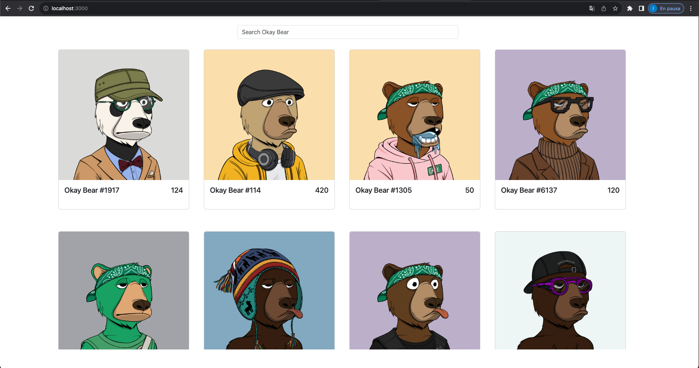
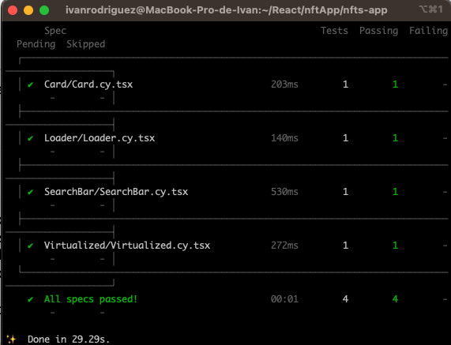
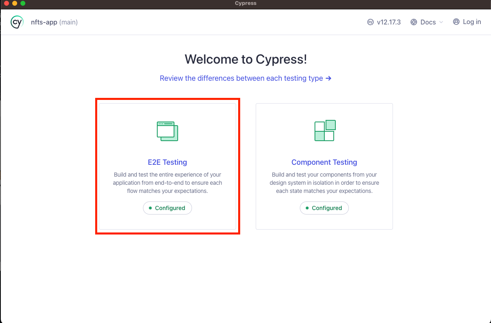
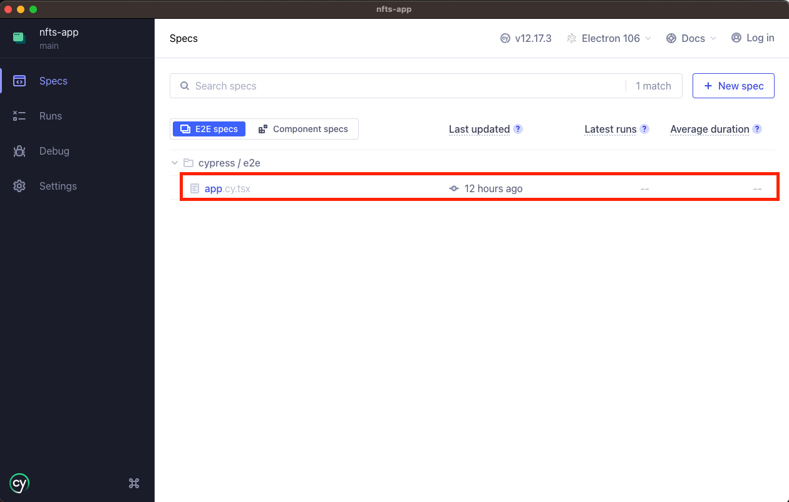
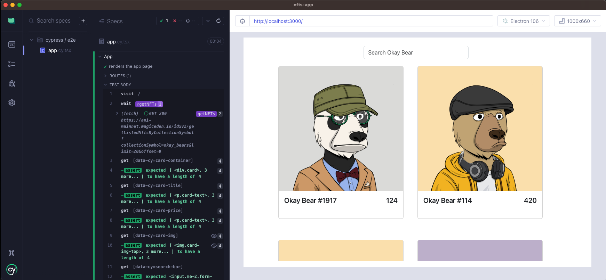
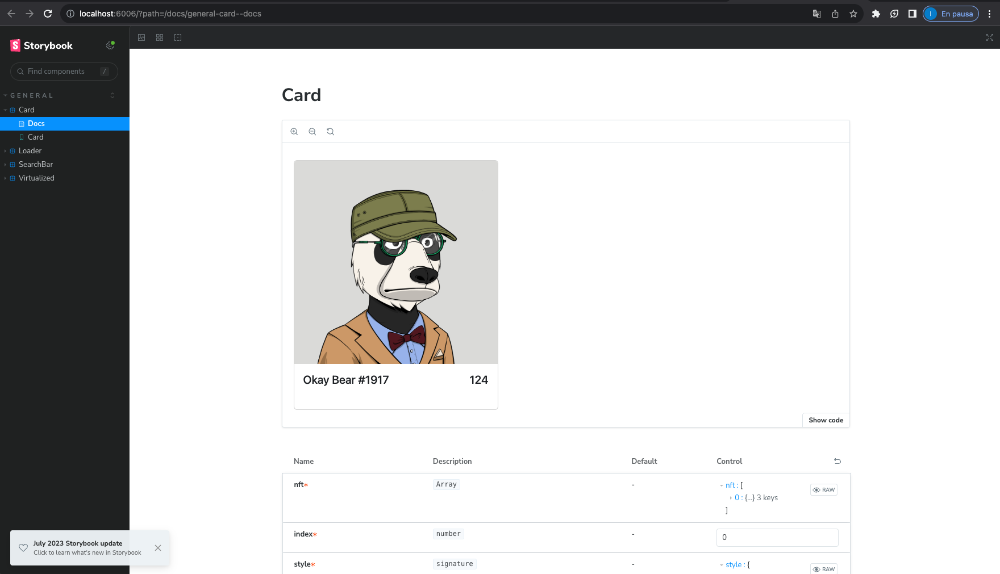
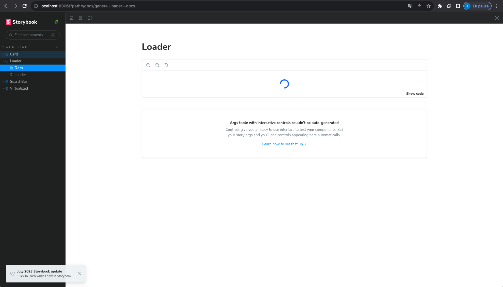
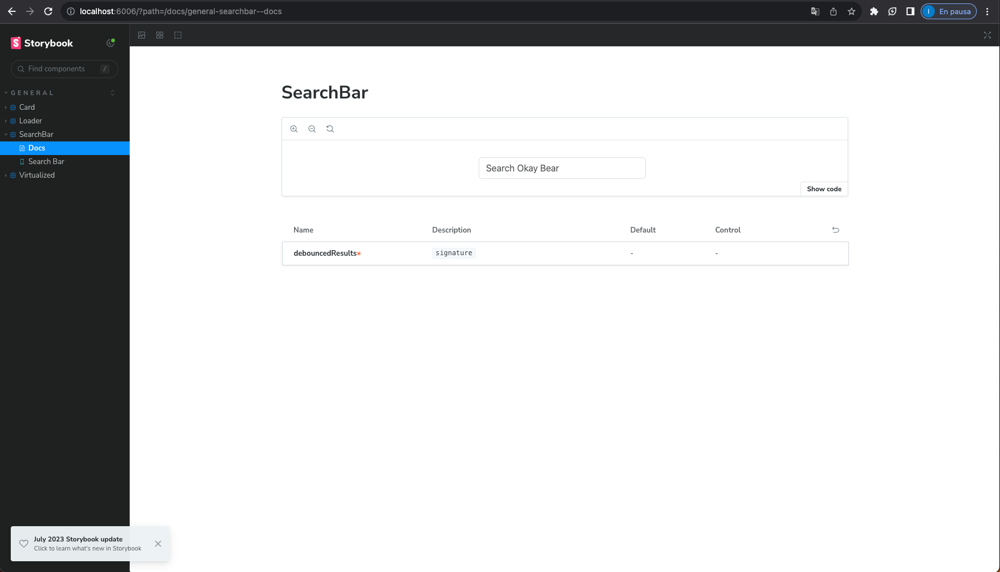
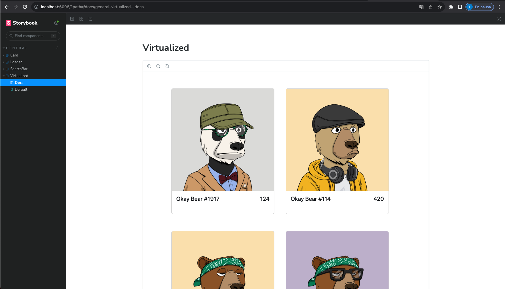

# NFT's App

This app is been build using Next.js and following the component design pattern.
this in order to split the responsibilities and treat it separately.
using cypress for testing, as the app mostly a UI app, without any complex calculation,
the app has the following structure
<br />
-- app - views and layouts
<br />
-- components
<br />
-- constants
<br />
-- cypress - all the cypress testing files
<br />
-- helpers -- shared logic across (single/multiple) files,  (views/components)
<br />

GITHUB `https://github.com/ivanxtr/bears`

# Prerequisites

- node `v18.17.0` or `nvm`


## NVM Installation guide

```
https://www.freecodecamp.org/news/node-version-manager-nvm-install-guide/
```

# Installation
## NVM Users
```
- nvm use
- yarn
```

```
- nvm use
- npm install
```

## Node Users
```
- yarn
```

# Starts the development server

```
- yarn dev
- go to http://localhost:3000
```

```
- npm run dev
- go to http://localhost:3000
```
<br />




# Creates a Build & Starts the Prod Server
```
- yarn build
- yarn start
- go to http://localhost:3000
```

```
- npm run build
- npm start
- go to http://localhost:3000
```


# Run Component Testing
```
- yarn test:components
```


# Run End to End Testing
- open 2 terminals
  - `first terminal --> yarn dev`
  - `second terminal --> yarn cypress:open`
- click on E2E Testing



- Choose your preferred browser
- Click on `Start E2E Testing ...`


- Click over the spec you want it test



- See the e2e testing result



# Run Storybook

```
- yarn storybook
```








# Chromatic 
```
https://www.chromatic.com/setup?appId=64d2afc575998db59c05dcd0
```
